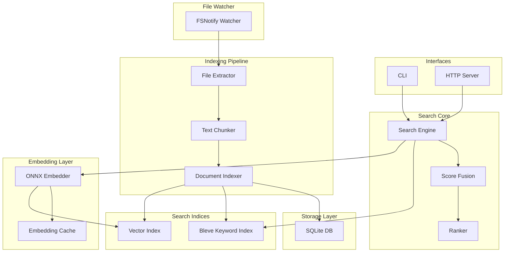
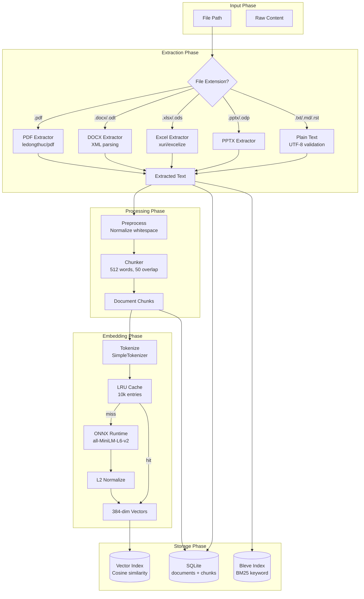
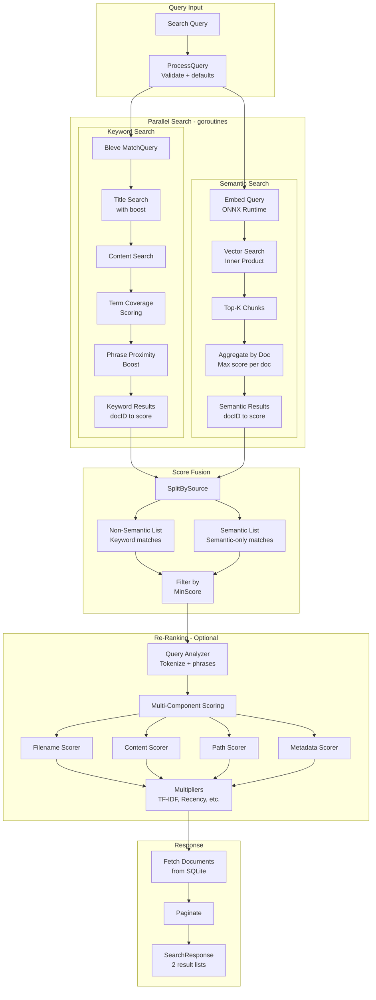
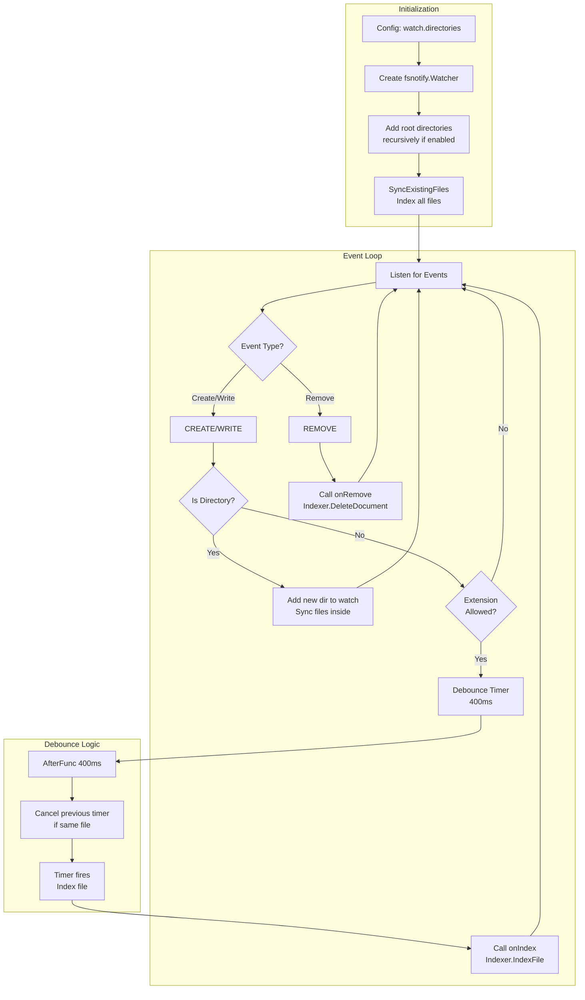
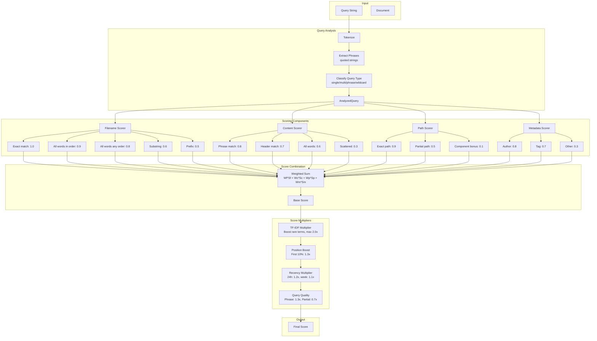
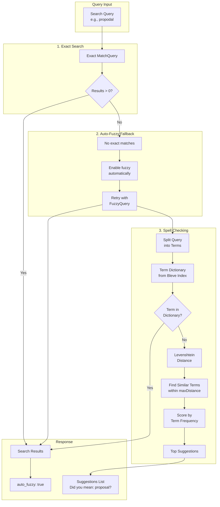
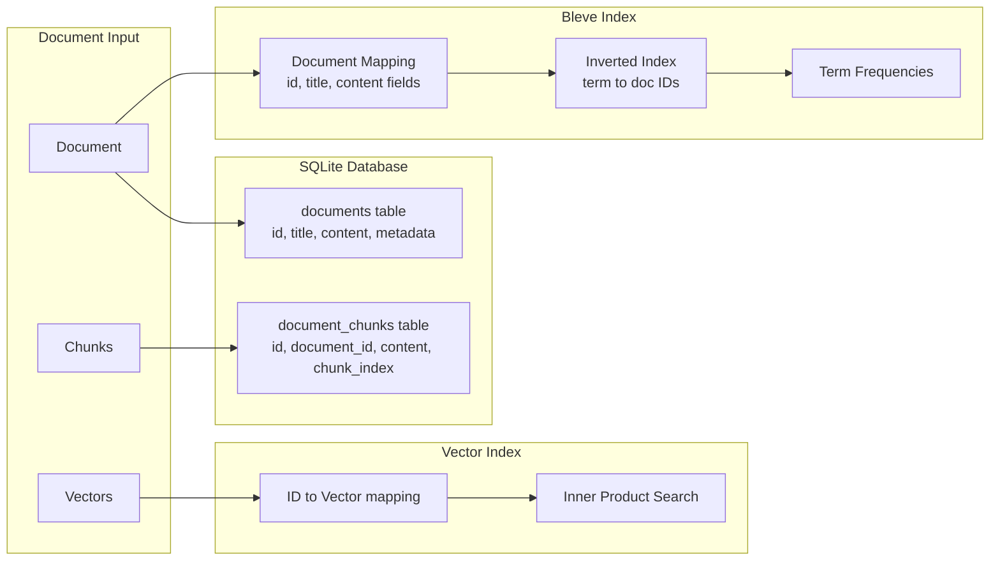

# Sagasu - Technical Documentation

Sagasu (探す, Japanese for "to search") is a fast, local hybrid search engine combining semantic and keyword search for macOS.

## Table of Contents

- [Project Overview](#project-overview)
- [System Architecture](#system-architecture)
- [Tech Stack](#tech-stack)
- [Core Modules](#core-modules)
- [Detailed Workflows](#detailed-workflows)
  - [Document Indexing Flow](#51-document-indexing-flow)
  - [Hybrid Search Flow](#52-hybrid-search-flow)
  - [File Watching Flow](#53-file-watching-flow)
  - [Ranking System Flow](#54-ranking-system-flow)
  - [Typo Tolerance Flow](#55-typo-tolerance-flow)
  - [Data Storage Flow](#56-data-storage-flow)
  - [Embedding Generation Flow](#57-embedding-generation-flow)
- [Configuration Reference](#configuration-reference)
- [Supported File Formats](#supported-file-formats)
- [API Endpoints](#api-endpoints)
- [CLI Commands](#cli-commands)
- [Performance Characteristics](#performance-characteristics)

---

## Project Overview

### Purpose

Sagasu is a **100% local, privacy-focused hybrid search engine** designed for macOS. It combines two complementary search approaches:

- **Keyword Search**: Traditional BM25-based full-text search for exact term matching
- **Semantic Search**: Vector embedding-based search for meaning-based similarity

### Key Features

| Feature              | Description                                                        |
| -------------------- | ------------------------------------------------------------------ |
| Fast                 | Sub-50ms query times for 100k documents                            |
| Hybrid Search        | Combines semantic (embeddings) and keyword (BM25) search           |
| Typo Tolerance       | Auto-fuzzy when no exact matches, plus "Did you mean?" suggestions |
| Low Memory           | Under 500MB for 100k documents                                     |
| 100% Local           | No external APIs or cloud services                                 |
| Private              | All data stays on your machine                                     |
| Simple               | CLI and HTTP API interfaces                                        |
| Directory Monitoring | Watch directories for file changes; auto-index on create/modify    |
| Multiple Formats     | PDF, DOCX, Excel, presentations, and plain text                    |

### Target Performance

| Documents | Query Time | Memory Usage |
| --------- | ---------- | ------------ |
| 10,000    | 10-20ms    | ~100MB       |
| 100,000   | 20-50ms    | ~500MB       |

---

## System Architecture

### High-Level Architecture



### Component Responsibilities

| Component        | Responsibility                                                           |
| ---------------- | ------------------------------------------------------------------------ |
| CLI              | Command-line interface for server, search, index, delete, watch commands |
| HTTP Server      | REST API for programmatic access                                         |
| Search Engine    | Orchestrates hybrid search execution                                     |
| Score Fusion     | Merges keyword and semantic results into two disjoint lists              |
| Ranker           | Optional content-aware re-ranking with multi-component scoring           |
| File Extractor   | Extracts text from various file formats (PDF, DOCX, Excel, etc.)         |
| Text Chunker     | Splits documents into overlapping chunks for semantic indexing           |
| Document Indexer | Coordinates storage across SQLite, Bleve, and Vector index               |
| Bleve Index      | Full-text keyword search using BM25 scoring                              |
| Vector Index     | Semantic similarity search using cosine similarity                       |
| ONNX Embedder    | Generates 384-dimensional embeddings using all-MiniLM-L6-v2              |
| Embedding Cache  | LRU cache to avoid re-computing embeddings                               |
| SQLite           | Persistent storage for documents and chunks                              |
| File Watcher     | Monitors directories for changes using fsnotify                          |

---

## Tech Stack

### Core Technologies

| Technology   | Purpose           | Package/Library                   |
| ------------ | ----------------- | --------------------------------- |
| Go 1.24+     | Primary language  | With CGO for ONNX                 |
| SQLite       | Document storage  | `github.com/mattn/go-sqlite3`     |
| Bleve        | Keyword search    | `github.com/blevesearch/bleve/v2` |
| ONNX Runtime | Neural embeddings | `github.com/yalue/onnxruntime_go` |
| fsnotify     | File watching     | `github.com/fsnotify/fsnotify`    |
| chi          | HTTP router       | `github.com/go-chi/chi/v5`        |
| zap          | Logging           | `go.uber.org/zap`                 |
| YAML         | Configuration     | `gopkg.in/yaml.v3`                |

### File Format Libraries

| Format        | Library                       |
| ------------- | ----------------------------- |
| PDF           | `github.com/ledongthuc/pdf`   |
| Excel (.xlsx) | `github.com/xuri/excelize/v2` |
| DOCX/ODT      | Built-in XML + ZIP parsing    |
| PPTX/ODP      | Built-in XML + ZIP parsing    |

### Embedding Model

| Property   | Value            |
| ---------- | ---------------- |
| Model      | all-MiniLM-L6-v2 |
| Size       | ~80MB            |
| Dimensions | 384              |
| Max Tokens | 256              |

---

## Core Modules

### Directory Structure

```
internal/
├── cli/          # CLI utilities and output formatting
├── config/       # Configuration loading and defaults
├── embedding/    # Embedder interface, ONNX implementation, caching
├── extract/      # File format extraction (PDF, DOCX, Excel, etc.)
├── fileid/       # File ID generation from paths
├── indexer/      # Document indexing, chunking, preprocessing
├── keyword/      # Bleve keyword search implementation
├── models/       # Data structures (Document, Query, Result)
├── ranking/      # Multi-component content-aware ranking
├── search/       # Search engine, fusion, processor, highlighter
├── server/       # HTTP server and handlers
├── storage/      # SQLite persistence layer
├── vector/       # Vector index interface, in-memory implementation
└── watcher/      # Directory monitoring with fsnotify
```

### Module Details

#### `config/`

- **config.go**: Configuration struct and YAML loader
- **defaults.go**: Default configuration values
- Handles path expansion, validation, and environment-specific settings

#### `models/`

- **document.go**: `Document`, `DocumentChunk`, `DocumentInput` types
- **query.go**: `SearchQuery` with validation
- **result.go**: `SearchResult`, `SearchResponse` types

#### `storage/`

- **storage.go**: Storage interface definition
- **sqlite.go**: SQLite implementation with WAL mode
- **disk.go**: Disk usage calculation utilities

#### `embedding/`

- **embedder.go**: `Embedder` interface
- **onnx.go**: ONNX Runtime implementation (requires CGO)
- **mock-embedder.go**: Hash-based mock for testing/CI
- **cache.go**: LRU embedding cache
- **tokenizer.go**: Simple tokenizer for ONNX model input

#### `vector/`

- **index.go**: `VectorIndex` interface
- **memory.go**: In-memory brute-force implementation
- **similarity.go**: Cosine similarity calculation

#### `keyword/`

- **index.go**: `KeywordIndex` and `TermDictionary` interfaces, `SearchOptions`
- **bleve.go**: Bleve implementation with smart boosting and fuzzy search support
- **spell-checker.go**: Spell checking and suggestion generation using Levenshtein distance
- **levenshtein.go**: Pure functions for computing edit distances (Levenshtein and Damerau-Levenshtein)

#### `search/`

- **engine.go**: Main search engine orchestration
- **fusion.go**: Score normalization and result splitting
- **processor.go**: Query validation and processing
- **highlighter.go**: Result highlighting (future)

#### `indexer/`

- **indexer.go**: Document indexing coordinator
- **chunker.go**: Text chunking with overlap
- **preprocessor.go**: Text preprocessing and normalization
- **batch.go**: Batch processing utilities

#### `extract/`

- **extractor.go**: Main extractor with format routing
- **pdf.go**: PDF text extraction
- **docx.go**: DOCX/ODT/RTF extraction
- **excel.go**: Excel extraction
- **pptx.go**: PPTX extraction
- **odp.go**, **ods.go**: OpenDocument format support
- **plain.go**: Plain text with UTF-8 validation

#### `ranking/`

- **ranker.go**: Main ranker with multi-component scoring
- **query_analyzer.go**: Query tokenization and classification
- **filename_scorer.go**: Filename matching scorer
- **content_scorer.go**: Content matching scorer
- **path_scorer.go**: Path matching scorer
- **metadata_scorer.go**: Metadata matching scorer
- **multipliers.go**: TF-IDF, recency, position multipliers
- **config.go**: Ranking configuration
- **types.go**: Shared types

#### `watcher/`

- **watcher.go**: Directory watcher with debouncing

#### `server/`

- **server.go**: HTTP server setup
- **handlers.go**: Request handlers for all endpoints

#### `cli/`

- **utils.go**: CLI output formatting and helpers

---

## Detailed Workflows

### 5.1 Document Indexing Flow

This flow describes what happens when a document is indexed via CLI (`sagasu index`) or API.



#### Step-by-Step Explanation

| Step | Component       | Tool/Library                  | Description                                                   |
| ---- | --------------- | ----------------------------- | ------------------------------------------------------------- |
| 1    | File Input      | `os.ReadFile`                 | Read file bytes from disk                                     |
| 2    | Extension Check | `filepath.Ext`                | Determine file type by extension                              |
| 3    | Text Extraction | Format-specific extractors    | Extract plain text from binary formats                        |
| 3a   | PDF             | `github.com/ledongthuc/pdf`   | Parse PDF structure, extract text from all pages              |
| 3b   | DOCX/ODT        | XML parsing + ZIP             | Unzip OOXML, parse `word/document.xml`, extract `<w:t>` nodes |
| 3c   | Excel           | `github.com/xuri/excelize/v2` | Read all sheets, extract cell values as tab-separated text    |
| 3d   | PPTX/ODP        | XML parsing + ZIP             | Extract text from slide XML files                             |
| 3e   | Plain text      | UTF-8 validation              | Clean and validate text encoding                              |
| 4    | Preprocessing   | `indexer.Preprocess()`        | Normalize whitespace, remove control characters               |
| 5    | Chunking        | `Chunker.Chunk()`             | Split into 512-word chunks with 50-word overlap for context   |
| 6    | Tokenization    | `SimpleTokenizer`             | Convert text to token IDs for ONNX model                      |
| 7    | Cache Check     | `EmbeddingCache`              | LRU cache lookup to avoid re-embedding same text              |
| 8    | Embedding       | ONNX Runtime                  | Run all-MiniLM-L6-v2 model to generate 384-dim vectors        |
| 9    | Normalization   | `NormalizeL2Slice()`          | Normalize vectors to unit length for cosine similarity        |
| 10   | SQLite Storage  | `go-sqlite3`                  | Store document metadata and chunk content                     |
| 11   | Keyword Index   | Bleve                         | Index document for BM25 keyword search                        |
| 12   | Vector Index    | `MemoryIndex`                 | Add vectors for semantic similarity search                    |

#### Key Code Paths

- Entry point: `internal/indexer/indexer.go` → `IndexFile()` or `IndexDocument()`
- Extraction: `internal/extract/extractor.go` → `Extract()`
- Chunking: `internal/indexer/chunker.go` → `Chunk()`
- Embedding: `internal/embedding/onnx.go` → `Embed()` or `EmbedBatch()`

---

### 5.2 Hybrid Search Flow

This flow describes what happens when a search query is executed.



#### Step-by-Step Explanation

| Step                      | Component              | Tool/Library                       | Description                                                              |
| ------------------------- | ---------------------- | ---------------------------------- | ------------------------------------------------------------------------ |
| 1                         | Query Validation       | `ProcessQuery()`                   | Validate query, set defaults (limit, score thresholds, enable flags)     |
| 1a                        | Spell Check (if fuzzy) | `SpellChecker.GetTopSuggestions()` | Generate "Did you mean?" suggestions for misspelled terms                |
| 2                         | Parallel Execution     | Go goroutines + `sync.WaitGroup`   | Run keyword and semantic search concurrently                             |
| **Keyword Path**          |                        |                                    |                                                                          |
| 3a                        | Bleve Query            | Bleve `MatchQuery` or `FuzzyQuery` | Search for query terms (with optional fuzzy matching for typos)          |
| 3b                        | Title Boost            | `TitleBoost` config                | Multiply title match scores (default 2.0x)                               |
| 3c                        | Term Coverage          | Per-term queries                   | Count how many query terms each doc matches                              |
| 3d                        | Phrase Boost           | `MatchPhraseQuery`                 | Boost docs with adjacent query terms (default 1.5x)                      |
| 3e                        | Score Formula          | Additive                           | `score = (titleScore * boost + contentScore) * coverage^2 * phraseBoost` |
| **Semantic Path**         |                        |                                    |                                                                          |
| 4a                        | Query Embedding        | ONNX + Cache                       | Convert query text to 384-dim vector                                     |
| 4b                        | Vector Search          | `MemoryIndex.Search()`             | Find top-K chunks by inner product (cosine for normalized)               |
| 4c                        | Chunk to Doc           | SQLite lookup                      | Map chunk IDs to document IDs                                            |
| 4d                        | Aggregation            | `AggregateSemanticByDocument()`    | Take max chunk score per document                                        |
| **Fusion**                |                        |                                    |                                                                          |
| 5                         | Split Results          | `SplitBySource()`                  | Separate into keyword-matches and semantic-only (no duplicates)          |
| 6                         | Filter                 | `filterByMinScore()`               | Remove results below threshold                                           |
| **Re-Ranking (Optional)** |                        |                                    |                                                                          |
| 7a                        | Query Analysis         | `QueryAnalyzer`                    | Tokenize, extract phrases, classify query type                           |
| 7b                        | Filename Score         | `FilenameScorer`                   | Exact match, prefix, substring, word matches                             |
| 7c                        | Content Score          | `ContentScorer`                    | Phrase match, header match, TF-IDF                                       |
| 7d                        | Path Score             | `PathScorer`                       | Path component matching                                                  |
| 7e                        | Metadata Score         | `MetadataScorer`                   | Author, tag matching                                                     |
| 7f                        | Multipliers            | TF-IDF, Position, Recency          | Apply score multipliers based on document properties                     |
| **Output**                |                        |                                    |                                                                          |
| 8                         | Fetch Documents        | SQLite                             | Load full document data for results                                      |
| 9                         | Paginate               | Offset + Limit                     | Apply pagination                                                         |
| 10                        | Response               | JSON                               | Return `SearchResponse` with two result lists                            |

#### Score Fusion Logic

Results are returned in **two disjoint lists**:

```
NonSemantic = {docs in keyword results} sorted by keyword_score desc
Semantic = {docs in semantic results BUT NOT in keyword} sorted by semantic_score desc
```

Documents that appear in both keyword and semantic results are assigned to the non-semantic list only, ensuring no duplicates.

#### Key Code Paths

- Entry point: `internal/search/engine.go` → `Search()`
- Fusion: `internal/search/fusion.go` → `SplitBySource()`
- Keyword search: `internal/keyword/bleve.go` → `Search()`
- Vector search: `internal/vector/memory.go` → `Search()`

---

### 5.3 File Watching Flow

This flow describes how the watcher monitors directories for changes.



#### Step-by-Step Explanation

| Step | Component           | Tool/Library                   | Description                                                     |
| ---- | ------------------- | ------------------------------ | --------------------------------------------------------------- |
| 1    | Configuration       | YAML config                    | Read `watch.directories`, `watch.extensions`, `watch.recursive` |
| 2    | Watcher Creation    | `github.com/fsnotify/fsnotify` | Create OS-level file system watcher                             |
| 3    | Add Directories     | `filepath.WalkDir`             | Recursively add all directories under each root                 |
| 4    | Initial Sync        | `SyncExistingFiles()`          | Index all existing files matching extensions                    |
| 5    | Event Loop          | Go channel                     | Listen for `watcher.Events` channel                             |
| 6    | Event Handling      | Switch on `fsnotify.Op`        | Handle CREATE, WRITE, REMOVE events                             |
| 7    | Directory Detection | `os.Stat().IsDir()`            | Check if event path is a directory                              |
| 8    | New Directory       | `handleNewDirectory()`         | Add to watch, sync files inside                                 |
| 9    | Extension Filter    | `matchExtension()`             | Only process files with allowed extensions                      |
| 10   | Debouncing          | `time.AfterFunc(400ms)`        | Wait 400ms before indexing to batch rapid changes               |
| 11   | Cancel Timer        | `timer.Stop()`                 | Cancel previous timer for same file if new event                |
| 12   | Index File          | `Indexer.IndexFile()`          | Extract, chunk, embed, store document                           |
| 13   | Remove File         | `Indexer.DeleteDocument()`     | Remove from SQLite, Bleve, Vector index                         |

#### Why Debouncing?

Many editors and IDEs save files in multiple write operations:

- Temporary file creation
- Write content
- Rename/move
- Update metadata

The 400ms debounce delay batches these rapid changes into a single index operation, preventing redundant work.

#### Incremental Sync

The watcher uses **incremental sync** to avoid re-indexing unchanged files:

- Each indexed file stores `source_mtime` and `source_size` in metadata
- On startup or file event, these are compared with current file stats
- If unchanged, the file is skipped (only keyword index is refreshed if needed)

#### Key Code Path

- Entry point: `internal/watcher/watcher.go` → `Start()`

---

### 5.4 Ranking System Flow

The content-aware ranker provides fine-grained relevance scoring beyond basic keyword/semantic scores.



#### Scoring Formula

```
BaseScore = (FilenameWeight × FilenameScore) +
            (ContentWeight × ContentScore) +
            (PathWeight × PathScore) +
            (MetadataWeight × MetadataScore)

FinalScore = BaseScore × TF-IDF × PositionBoost × Recency × QueryQuality
```

#### Default Weights

| Component | Weight |
| --------- | ------ |
| Filename  | 0.3    |
| Content   | 0.5    |
| Path      | 0.1    |
| Metadata  | 0.1    |

#### Scoring Components

**Filename Scorer:**
| Match Type | Score |
|------------|-------|
| Exact match | 1.0 |
| All words in order | 0.9 |
| All words any order | 0.8 |
| Substring match | 0.6 |
| Prefix match | 0.5 |

**Content Scorer:**
| Match Type | Score |
|------------|-------|
| Phrase match | 0.8 |
| Header match | 0.7 |
| All words present | 0.6 |
| Scattered words | 0.3 |

**Multipliers:**
| Multiplier | Effect |
|------------|--------|
| TF-IDF | Boost rare terms (max 2.0x) |
| Position Boost | Matches in first 10% of content get 1.3x |
| Recency | 24h: 1.2x, 1 week: 1.1x, 1 month: 1.05x |
| Query Quality | Phrase match: 1.3x, Partial match: 0.7x |

#### Key Code Path

- Entry point: `internal/ranking/ranker.go` → `Rank()` or `RankWithContext()`

---

### 5.5 Typo Tolerance Flow

The typo tolerance feature provides three capabilities:

1. **Auto-fuzzy fallback** - Automatically retries with fuzzy search when exact search returns 0 results
2. **Fuzzy matching** - Finds results despite typos using Levenshtein edit distance
3. **Spell suggestions** - "Did you mean?" suggestions for misspelled queries



#### How It Works

| Component                | Description                                                                                                                             |
| ------------------------ | --------------------------------------------------------------------------------------------------------------------------------------- |
| **Auto-Fuzzy Fallback**  | When exact search returns 0 results, automatically retries with fuzzy enabled. Response includes `auto_fuzzy: true` to indicate this.   |
| **Fuzzy Search**         | Uses Bleve's `FuzzyQuery` to find documents even when query terms have typos. Configurable fuzziness level (Levenshtein edit distance). |
| **Spell Checker**        | Compares query terms against the index's term dictionary to detect misspellings.                                                        |
| **Term Dictionary**      | Extracted from Bleve's field dictionaries, contains all indexed terms with their document frequencies.                                  |
| **Levenshtein Distance** | Algorithm measuring the minimum number of single-character edits (insertions, deletions, substitutions) between two strings.            |
| **Suggestions**          | Ranked by score: `(1 / (distance + 1)) * frequency`. Terms with lower edit distance and higher frequency rank higher.                   |

#### Configuration

| Option          | Type | Default | Description                                                             |
| --------------- | ---- | ------- | ----------------------------------------------------------------------- |
| `fuzzy_enabled` | bool | `false` | Force fuzzy matching (auto-fuzzy happens regardless when results are 0) |
| `fuzziness`     | int  | `2`     | Maximum Levenshtein edit distance (1-2 recommended)                     |

#### Spell Checker Options

| Option           | Default | Description                             |
| ---------------- | ------- | --------------------------------------- |
| `maxDistance`    | `2`     | Maximum edit distance for suggestions   |
| `minFrequency`   | `1`     | Minimum term frequency to be considered |
| `maxSuggestions` | `5`     | Maximum suggestions per misspelled term |

#### Example

**Query**: `"propodal"` (typo for "proposal")

**CLI Output**:

```
Found 3 results in 15ms (3 keyword-only, 0 semantic-only)

No exact matches found. Showing fuzzy results instead.

Did you mean: proposal?

--- Non-semantic (keyword) results ---
...
```

**JSON Response**:

```json
{
  "non_semantic_results": [...],
  "semantic_results": [...],
  "suggestions": ["proposal"],
  "auto_fuzzy": true,
  "query": "propodal"
}
```

The auto-fuzzy feature automatically finds documents containing "proposal" despite the typo, and the suggestions field shows the corrected query.

#### Key Code Paths

- Auto-Fuzzy: `cmd/sagasu/main.go` → `runSearch()` (retry logic)
- Spell Checker: `internal/keyword/spell-checker.go` → `NewSpellChecker()`, `Check()`, `GetTopSuggestions()`
- Levenshtein: `internal/keyword/levenshtein.go` → `LevenshteinDistance()`, `DamerauLevenshteinDistance()`
- Fuzzy Search: `internal/keyword/bleve.go` → `buildFuzzyQuery()`
- Integration: `internal/search/engine.go` → `WithSpellChecker()`, `Search()`

---

### 5.6 Data Storage Flow

Shows how data flows through the storage layer.



#### Storage Components

| Component    | Technology             | Purpose                     | Data Stored                      |
| ------------ | ---------------------- | --------------------------- | -------------------------------- |
| SQLite       | `go-sqlite3`           | Persistent document storage | Documents, chunks, metadata      |
| Bleve        | `blevesearch/bleve/v2` | Full-text keyword search    | Inverted index, term frequencies |
| Vector Index | Custom `MemoryIndex`   | Semantic similarity search  | Vector embeddings, ID mappings   |

#### SQLite Schema

```sql
-- Documents table
CREATE TABLE documents (
    id TEXT PRIMARY KEY,
    title TEXT,
    content TEXT NOT NULL,
    metadata TEXT,  -- JSON
    created_at TIMESTAMP DEFAULT CURRENT_TIMESTAMP,
    updated_at TIMESTAMP DEFAULT CURRENT_TIMESTAMP
);

CREATE INDEX idx_documents_created_at ON documents(created_at);

-- Chunks table (for semantic search)
CREATE TABLE document_chunks (
    id TEXT PRIMARY KEY,
    document_id TEXT NOT NULL,
    content TEXT NOT NULL,
    chunk_index INTEGER NOT NULL,
    created_at TIMESTAMP DEFAULT CURRENT_TIMESTAMP,
    FOREIGN KEY (document_id) REFERENCES documents(id) ON DELETE CASCADE
);

CREATE INDEX idx_chunks_document_id ON document_chunks(document_id);
CREATE INDEX idx_chunks_document_chunk ON document_chunks(document_id, chunk_index);
```

#### Bleve Index Mapping

```go
// Document mapping with standard analyzer (no stemming)
docMapping := bleve.NewDocumentMapping()
textFieldMapping := bleve.NewTextFieldMapping()
textFieldMapping.Analyzer = standard.Name  // lowercase + tokenize
docMapping.AddFieldMappingsAt("content", textFieldMapping)
docMapping.AddFieldMappingsAt("title", textFieldMapping)
keywordFieldMapping := bleve.NewKeywordFieldMapping()
docMapping.AddFieldMappingsAt("id", keywordFieldMapping)
```

#### Vector Index Format

The in-memory vector index persists to disk in binary format:

```
[dimensions: 4 bytes][count: 4 bytes]
[id_len: 4 bytes][id_bytes: variable][vector: dimensions*4 bytes]
... repeated for each vector ...
```

---

### 5.7 Embedding Generation Flow

Shows how text is converted to vector embeddings.

```mermaid
flowchart LR
    subgraph Input[Input]
        Text[Text String]
    end

    subgraph Cache[Cache Layer]
        CacheCheck{In Cache?}
        CacheHit[Return Cached]
        CacheMiss[Continue to ONNX]
    end

    subgraph Tokenize[Tokenization]
        Split[Split Words]
        Vocab[Lookup Vocab IDs<br/>Hash-based mapping]
        Pad[Pad to max_tokens<br/>256 tokens]
        Tensors[Create Tensors<br/>input_ids, attention_mask, token_type_ids]
    end

    subgraph ONNX[ONNX Runtime]
        Session[AdvancedSession]
        Model[all-MiniLM-L6-v2<br/>~80MB ONNX model]
        Inference[Run Inference]
        Output[Raw Output<br/>384 floats]
    end

    subgraph Normalize[Normalization]
        L2[L2 Normalize<br/>Unit length]
        Vector[384-dim Vector]
    end

    subgraph Store[Store]
        CacheStore[Store in LRU Cache]
        Return[Return Vector]
    end

    Text --> CacheCheck
    CacheCheck -->|Yes| CacheHit
    CacheCheck -->|No| CacheMiss
    CacheHit --> Return

    CacheMiss --> Split
    Split --> Vocab
    Vocab --> Pad
    Pad --> Tensors

    Tensors --> Session
    Session --> Model
    Model --> Inference
    Inference --> Output

    Output --> L2
    L2 --> Vector
    Vector --> CacheStore
    CacheStore --> Return
```



#### Embedding Details

| Property      | Value            | Description                               |
| ------------- | ---------------- | ----------------------------------------- |
| Model         | all-MiniLM-L6-v2 | Sentence transformer model                |
| Dimensions    | 384              | Output vector size                        |
| Max Tokens    | 256              | Maximum input length                      |
| Cache Size    | 10,000           | LRU cache capacity                        |
| Normalization | L2               | Unit length vectors for cosine similarity |

#### Why L2 Normalization?

- **Normalized vectors enable cosine similarity via simple dot product**
- Inner product of unit vectors equals cosine similarity: `cos(θ) = a·b / (|a||b|)` becomes `a·b` when `|a|=|b|=1`
- **Faster computation** than computing full cosine formula each time

#### Tokenization Process

1. **Split**: Break text into words by whitespace
2. **Vocab Lookup**: Map each word to a token ID using hash-based mapping
3. **Special Tokens**: Add `[CLS]` (101) at start, `[SEP]` (102) at end
4. **Padding**: Pad to `max_tokens` (256) with zeros
5. **Attention Mask**: 1 for real tokens, 0 for padding

#### Pre-allocated Tensors

For performance, ONNX tensors are pre-allocated once and reused:

- `input_ids`: Token IDs
- `attention_mask`: Which tokens are real vs padding
- `token_type_ids`: Segment IDs (all zeros for single-segment input)
- `output`: Pre-allocated output buffer

---

## Configuration Reference

### Configuration File

Default path: `/usr/local/etc/sagasu/config.yaml`

Override with `--config` flag on any command.

### Full Configuration Example

```yaml
# Set to true for verbose debug logging
debug: false

server:
  host: "localhost"
  port: 8080

storage:
  database_path: "/usr/local/var/sagasu/data/db/documents.db"
  bleve_index_path: "/usr/local/var/sagasu/data/indices/bleve"
  faiss_index_path: "/usr/local/var/sagasu/data/indices/faiss"

embedding:
  model_path: "/usr/local/var/sagasu/data/models/all-MiniLM-L6-v2.onnx"
  dimensions: 384
  max_tokens: 256
  use_quantization: true
  cache_size: 10000

search:
  default_limit: 10
  max_limit: 100
  default_keyword_enabled: true
  default_semantic_enabled: true
  chunk_size: 512
  chunk_overlap: 50
  top_k_candidates: 100

# Directory monitoring
watch:
  directories: [] # e.g. ["/path/to/docs", "~/notes"]
  extensions:
    [".txt", ".md", ".rst", ".pdf", ".docx", ".xlsx", ".pptx", ".odp", ".ods"]
  recursive: true
```

### Configuration Sections

#### Server

| Option | Type   | Default       | Description              |
| ------ | ------ | ------------- | ------------------------ |
| `host` | string | `"localhost"` | HTTP server bind address |
| `port` | int    | `8080`        | HTTP server port         |

#### Storage

| Option             | Type   | Default   | Description               |
| ------------------ | ------ | --------- | ------------------------- |
| `database_path`    | string | See above | SQLite database file path |
| `bleve_index_path` | string | See above | Bleve index directory     |
| `faiss_index_path` | string | See above | Vector index file path    |

#### Embedding

| Option             | Type   | Default   | Description                  |
| ------------------ | ------ | --------- | ---------------------------- |
| `model_path`       | string | See above | ONNX model file path         |
| `dimensions`       | int    | `384`     | Embedding vector dimensions  |
| `max_tokens`       | int    | `256`     | Maximum input tokens         |
| `use_quantization` | bool   | `true`    | Use quantized model (future) |
| `cache_size`       | int    | `10000`   | LRU cache capacity           |

#### Search

| Option                     | Type | Default | Description                             |
| -------------------------- | ---- | ------- | --------------------------------------- |
| `default_limit`            | int  | `10`    | Default results per query               |
| `max_limit`                | int  | `100`   | Maximum results per query               |
| `default_keyword_enabled`  | bool | `true`  | Enable keyword search by default        |
| `default_semantic_enabled` | bool | `true`  | Enable semantic search by default       |
| `chunk_size`               | int  | `512`   | Words per chunk                         |
| `chunk_overlap`            | int  | `50`    | Overlapping words between chunks        |
| `top_k_candidates`         | int  | `100`   | Candidates to consider from each search |

#### Watch

| Option        | Type     | Default   | Description               |
| ------------- | -------- | --------- | ------------------------- |
| `directories` | []string | `[]`      | Root directories to watch |
| `extensions`  | []string | See above | File extensions to index  |
| `recursive`   | bool     | `true`    | Watch subdirectories      |

---

## Supported File Formats

### Document Formats

| Extension | Format            | Extractor                   |
| --------- | ----------------- | --------------------------- |
| `.txt`    | Plain text        | UTF-8 validation            |
| `.md`     | Markdown          | Treated as plain text       |
| `.rst`    | reStructuredText  | Treated as plain text       |
| `.pdf`    | PDF               | `github.com/ledongthuc/pdf` |
| `.docx`   | Word 2007+        | XML + ZIP parsing           |
| `.odt`    | OpenDocument Text | XML + ZIP parsing           |
| `.rtf`    | Rich Text Format  | Shares DOCX extractor       |

### Spreadsheet Formats

| Extension | Format                   | Extractor                     |
| --------- | ------------------------ | ----------------------------- |
| `.xlsx`   | Excel 2007+              | `github.com/xuri/excelize/v2` |
| `.ods`    | OpenDocument Spreadsheet | XML + ZIP parsing             |

### Presentation Formats

| Extension | Format                    | Extractor         |
| --------- | ------------------------- | ----------------- |
| `.pptx`   | PowerPoint 2007+          | XML + ZIP parsing |
| `.odp`    | OpenDocument Presentation | XML + ZIP parsing |

---

## API Endpoints

### Search

**POST /api/v1/search**

Run a hybrid (keyword + semantic) search.

Request:

```json
{
  "query": "machine learning",
  "limit": 10,
  "offset": 0,
  "keyword_enabled": true,
  "semantic_enabled": true,
  "fuzzy_enabled": false,
  "min_keyword_score": 0.0,
  "min_semantic_score": 0.0
}
```

| Field                | Type   | Default  | Description                              |
| -------------------- | ------ | -------- | ---------------------------------------- |
| `query`              | string | required | Search query text                        |
| `limit`              | int    | `10`     | Maximum results to return                |
| `offset`             | int    | `0`      | Results offset for pagination            |
| `keyword_enabled`    | bool   | `true`   | Enable keyword (BM25) search             |
| `semantic_enabled`   | bool   | `true`   | Enable semantic (vector) search          |
| `fuzzy_enabled`      | bool   | `false`  | Enable fuzzy matching for typo tolerance |
| `min_keyword_score`  | float  | `0.0`    | Minimum score for keyword results        |
| `min_semantic_score` | float  | `0.0`    | Minimum score for semantic results       |

Response:

```json
{
  "non_semantic_results": [...],
  "semantic_results": [...],
  "suggestions": ["corrected query"],
  "auto_fuzzy": false,
  "total_non_semantic": 5,
  "total_semantic": 3,
  "query_time_ms": 25,
  "query": "machine learning"
}
```

| Field                  | Type   | Description                                                                      |
| ---------------------- | ------ | -------------------------------------------------------------------------------- |
| `non_semantic_results` | array  | Results from keyword search (or both if matched)                                 |
| `semantic_results`     | array  | Results from semantic search only (not in keyword results)                       |
| `suggestions`          | array  | Spelling suggestions when fuzzy is enabled (e.g., "Did you mean...")             |
| `auto_fuzzy`           | bool   | True if fuzzy was automatically enabled because exact search returned no results |
| `total_non_semantic`   | int    | Total count of non-semantic results                                              |
| `total_semantic`       | int    | Total count of semantic-only results                                             |
| `query_time_ms`        | int    | Query execution time in milliseconds                                             |
| `query`                | string | Original query string                                                            |

### Documents

**POST /api/v1/documents** - Index a document

**GET /api/v1/documents/{id}** - Get document by ID

**DELETE /api/v1/documents/{id}** - Delete document

### Watch Directories

**GET /api/v1/watch/directories** - List watched directories

**POST /api/v1/watch/directories** - Add directory to watch

**DELETE /api/v1/watch/directories** - Remove directory from watch

### Status

**GET /api/v1/status** - Engine statistics

**GET /health** - Health check

See [docs/API.md](docs/API.md) for complete API documentation.

---

## CLI Commands

### server

Start the HTTP API server.

```bash
sagasu server [--config PATH] [--debug]
```

### search

Run a hybrid search. **Fuzzy search is automatic**: if no exact matches are found, the search automatically retries with typo tolerance enabled.

```bash
sagasu search [flags] <query>

# Examples
sagasu search "machine learning algorithms"
sagasu search --limit 20 "neural networks"
sagasu search --keyword=false "meaning-based only"   # semantic-only
sagasu search --semantic=false "exact terms"         # keyword-only
sagasu search "propodal"                             # auto-fuzzy if no exact match
sagasu search --fuzzy "propodal"                     # force fuzzy from the start
sagasu search --output json "query"                  # JSON output
```

| Flag         | Type   | Default | Description                                                     |
| ------------ | ------ | ------- | --------------------------------------------------------------- |
| `--limit`    | int    | `10`    | Maximum results                                                 |
| `--keyword`  | bool   | `true`  | Enable keyword search                                           |
| `--semantic` | bool   | `true`  | Enable semantic search                                          |
| `--fuzzy`    | bool   | `false` | Force fuzzy from start (auto-enabled if no exact matches found) |
| `--output`   | string | `text`  | Output format (`text` or `json`)                                |

### index

Index a file or directory.

```bash
sagasu index [flags] <file-or-directory>

# Examples
sagasu index document.txt
sagasu index report.pdf
sagasu index ./dev/sample
```

### delete

Delete a document by ID.

```bash
sagasu delete [flags] <document-id>
```

### watch

Manage watched directories.

```bash
sagasu watch add <path>
sagasu watch remove <path>
sagasu watch list
```

### version

Print version.

```bash
sagasu version
```

See [docs/CLI.md](docs/CLI.md) for complete CLI documentation.

---

## Performance Characteristics

### Query Performance

| Documents | Query Time (approx) | Notes                       |
| --------- | ------------------- | --------------------------- |
| 10,000    | 10-20ms             | Parallel search execution   |
| 100,000   | 20-50ms             | With ONNX + in-memory index |
| 1,000,000 | 50-200ms            | May require FAISS for scale |

### Memory Usage

| Documents | Memory (approx) | Notes                              |
| --------- | --------------- | ---------------------------------- |
| 10,000    | ~100MB          | Primarily vector index             |
| 100,000   | ~500MB          | 384 dims × 4 bytes × chunks        |
| 1,000,000 | ~2GB            | Consider FAISS for larger datasets |

### Indexing Performance

| Operation              | Time (approx) | Notes                    |
| ---------------------- | ------------- | ------------------------ |
| Text file              | <100ms        | Primarily embedding time |
| PDF (10 pages)         | 200-500ms     | OCR not included         |
| Directory (1000 files) | 2-5 min       | Depends on file sizes    |

### Optimization Tips

1. **Use embedding cache**: Repeated queries benefit from caching
2. **Tune chunk size**: Larger chunks = fewer vectors but less granularity
3. **Set min_score thresholds**: Filter low-confidence results early
4. **Watch directories**: Auto-index is more efficient than manual re-indexing
5. **Use incremental sync**: Unchanged files are automatically skipped

---

## License

MIT License - see [LICENSE](LICENSE) for details.
